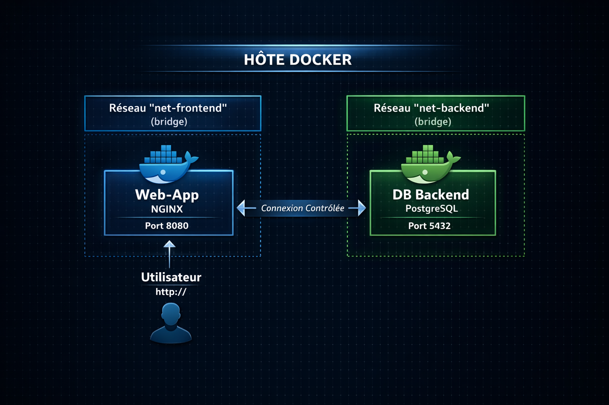

# TP01 — DÉPLOIEMENT & DURCISSEMENT D’UNE ARCHITECTURE CONTENEURISÉE (DOCKER)
    
**Objectif :** Déployer une architecture Web + DB sécurisée en appliquant les bonnes pratiques DevSecOps.  
**Environnement cible :** Debian 13 (Trixie) à jour  
**Niveau :** Master 1 Cybersécurité - CODA Orléans  
**Durée estimée :** 2h30

## 🎯 OBJECTIF GLOBAL DU TP

Déployer une architecture Web + Base de données en appliquant :
- Installeation Docker via dépôt officiel (chaîne de confiance)
- Segmentation réseau Frontend / backend
- Image Docker (Web) durcie (non-root + base légère + multi-stage + port non privilégié)
- Audit vulnérabilités avec Trivy (HIGH/CRITICAL)
- Runtime hardening (read-only, no-new-privileges, cap-drop, limites ressources)
- Tests réels prouvant l’isolation réseau
- Gestion des secrets de manière sécurisée

## 📋 PRÉREQUIS

- Une machine Debian 13 (Trixie) avec accès internet
- Droits `sudo` sur la machine
- Connaissances de base en ligne de commande Linux

## 🏗️ ARCHITECHTURE CIBLE



## 🔧 DÉROULEMENT DU TP

### IMPORTANT

- Le serveur Debian 13 doit être connecté à Internet (pour apt, Docker repo, Trivy, images).
- Tout le TP est en copier/coller, étape par étape.

### ÉTAPE 0 : PREPARATION DE L'ENVIRONNEMENT (PRÉREQUIS RÉSEAU + DÉPÔTS OFFICIELS DEBIAN 13)

Avant de commencer, comprenez pourquoi ces étapes sont cruciales :

- **Dépôts à jour** : éviter d'installer des paquets vulnérables
- **Connectivité** : Docker et Trivy nécessitent des téléchargements
- **Clés GPG** : garantir l'authenticité des logiciels installés

```bash
# Vérifie la connectivité Internet (DNS + accès)
ping -c 2 deb.debian.org
# Attendu : réponses OK (0% packet loss)

# Vérifie l’accès HTTPS (utile pour dépôts / clés)
curl -I https://deb.debian.org
# Attendu : HTTP/2 200 ou HTTP/1.1 200 (ou 301/302 acceptable)

# (Option) Vérifie que la distro est bien Debian 13 (Trixie)
lsb_release -a
# Attendu : Codename: trixie

# Insère les dépôts officiels Debian 13 (main + contrib + non-free + non-free-firmware)
# Note : adapte "main contrib non-free non-free-firmware" selon ta politique (ex: main uniquement).
sudo tee /etc/apt/sources.list > /dev/null <<'EOF'
deb http://deb.debian.org/debian trixie main contrib non-free non-free-firmware
deb http://deb.debian.org/debian trixie-updates main contrib non-free non-free-firmware
deb http://security.debian.org/debian-security trixie-security main contrib non-free non-free-firmware
EOF
# Attendu (cat /etc/apt/sources.list) : le fichier /etc/apt/sources.list est remplacé avec ces 3 lignes

# Met à jour Debian 13 (recommandé avant d’installer Docker)
sudo apt update
sudo apt upgrade -y
# Attendu : update/upgrade sans erreurs de dépôt
```

### ÉTAPE 1 : INSTALLATION DOCKER VIA DÉPÔT OFFICIEL DOCKER (https://docs.docker.com/engine/install/debian/)

Pourquoi cette méthode ?

- Dépôt officiel Docker (pas de version obsolete des dépôts Debian)
- Vérification GPG (empêche les attaques de type "man-in-the-middle")
- Activation automatique du service

```bash
# Met à jour l’index des paquets
sudo apt update

# Installe les dépendances nécessaires à l’ajout d’un dépôt HTTPS signé
sudo apt install -y ca-certificates curl gnupg lsb-release

# Crée le dossier standard pour stocker les clés GPG APT
sudo install -m 0755 -d /etc/apt/keyrings

# Télécharge et enregistre la clé officielle Docker
curl -fsSL https://download.docker.com/linux/debian/gpg | sudo gpg --dearmor -o /etc/apt/keyrings/docker.gpg

# Rend la clé lisible par APT
sudo chmod a+r /etc/apt/keyrings/docker.gpg

# Ajoute le dépôt Docker stable correspondant à la version Debian (trixie)
# Si le repo Docker ne supporte pas encore "trixie" dans ton contexte, remplace $(lsb_release -cs) par "bookworm".
echo "deb [arch=$(dpkg --print-architecture) signed-by=/etc/apt/keyrings/docker.gpg] https://download.docker.com/linux/debian $(lsb_release -cs) stable" | sudo tee /etc/apt/sources.list.d/docker.list > /dev/null

# Recharge l’index des paquets incluant le dépôt Docker
sudo apt update

# Installe Docker Engine et ses composants
sudo apt install -y docker-ce docker-ce-cli containerd.io docker-buildx-plugin docker-compose-plugin

# Démarre Docker et l’active au démarrage
sudo systemctl enable --now docker

# Vérifie que Docker est actif
sudo systemctl status docker --no-pager
# Attendu : active (running)

# Teste le bon fonctionnement de Docker
sudo docker run --rm hello-world
# Attendu : message “Hello from Docker!”
```

### ÉTAPE 2 : SEGMENTATION RÉSEAU (FRONTEND / BACKEND)

Pourquoi segmenter ?

- 🛡️ Principe du moindre privilège : la DB n'a pas besoin d'être accessible depuis l'extérieur
- 🔒 Limitation du mouvement latéral : si le web est compromis, la DB n'est pas directement exposée

```bash
# Crée le réseau frontend (exposition Web)
sudo docker network create --driver bridge net-frontend

# Crée le réseau backend (réseau interne pour la base)
sudo docker network create --driver bridge net-backend

# Vérifie que les deux réseaux existent
sudo docker network ls | grep -E "net-frontend|net-backend"
# Attendu : les deux réseaux sont listés
```

### ÉTAPE 3 : CONSTRUCTION D’UNE IMAGE WEB DURCIE (NGINX NON-ROOT SUR 8080)

Pourquoi ce Dockerfile est amélioré ?

- ✅ Non-root : l'utilisateur appuser limite les dégâts en cas de compromission
- ✅ Permissions strictes : seul ce qui est nécessaire est accessible

```bash
# Crée le dossier de travail et s’y place
mkdir -p ~/tp01-hardening && cd ~/tp01-hardening

# Crée la page HTML servie par Nginx
cat > index.html <<'EOF'
<!doctype html>
<html lang="fr">
  <head><meta charset="utf-8"><title>Service sécurisé - CODA</title></head>
  <body>
    <h1>Service Sécurisé - CODA Orléans</h1>
    <p>TP01 : non-root, segmentation, scan Trivy, runtime hardening.</p>
  </body>
</html>
EOF
# Attendu : le fichier index.html existe dans ~/tp01-hardening

# Configure Nginx pour écouter sur 8080 (port non privilégié compatible non-root)
cat > default.conf <<'EOF'
server {
    listen       8080;
    server_name  localhost;

    access_log  /dev/stdout;
    error_log   /dev/stderr warn;

    location / {
        root   /usr/share/nginx/html;
        index  index.html;
    }
}
EOF
# Attendu : le fichier default.conf existe dans ~/tp01-hardening

# Crée un Dockerfile avec :
# - base alpine (image légère)
# - utilisateur non-root
# - permissions adaptées aux répertoires nécessaires
cat > Dockerfile <<'EOF'
FROM nginx:alpine

RUN addgroup -S appgroup && adduser -S appuser -G appgroup

RUN mkdir -p /var/cache/nginx /var/run /var/log/nginx && \
    chown -R appuser:appgroup \
      /var/cache/nginx /var/run /var/log/nginx \
      /usr/share/nginx/html /etc/nginx/conf.d

COPY default.conf /etc/nginx/conf.d/default.conf
COPY index.html /usr/share/nginx/html/index.html

USER appuser
EXPOSE 8080
EOF
# Attendu : le fichier Dockerfile existe dans ~/tp01-hardening

# Construit l’image durcie
sudo docker build -t app-coda-web:1.0 .
# Attendu : build terminé sans erreur

# Vérifie que l’image existe
sudo docker images | grep app-coda-web
# Attendu : app-coda-web:1.0 visible
```

### ÉTAPE 4 : AUDIT DE SÉCURITÉ AVEC TRIVY

```bash
# Crée le dossier keyrings si nécessaire
sudo install -m 0755 -d /etc/apt/keyrings

# Télécharge la clé GPG officielle Trivy
curl -fsSL https://aquasecurity.github.io/trivy-repo/deb/public.key | sudo gpg --dearmor -o /etc/apt/keyrings/trivy.gpg

# Rend la clé lisible
sudo chmod a+r /etc/apt/keyrings/trivy.gpg

# Ajoute le dépôt Trivy (https://trivy.dev/docs/latest/getting-started/installation/#debianubuntu-official)
# Si le repo Trivie ne supporte pas encore "trixie", remplace $(lsb_release -cs) par "bookworm".
echo "deb [signed-by=/etc/apt/keyrings/trivy.gpg] https://aquasecurity.github.io/trivy-repo/deb $(lsb_release -cs) main" | sudo tee /etc/apt/sources.list.d/trivy.list > /dev/null

# Met à jour l’index APT
sudo apt update

# Installe Trivy
sudo apt install -y trivy
# Attendu : trivy installé

# Scanne l’image pour vulnérabilités HIGH/CRITICAL
trivy image --severity HIGH,CRITICAL app-coda-web:1.0
# Attendu : rapport CVE affiché (vide ou non selon versions)
```

### ÉTAPE 5 : DÉPLOIEMENT DB ISOLÉE (BACKEND UNIQUEMENT)

```bash
# Lance PostgreSQL uniquement sur le réseau backend (aucun port publié vers l’hôte)
sudo docker run -d --name db-backend --network net-backend \
  -e POSTGRES_PASSWORD='codaPassw0rd!' \
  -e POSTGRES_DB='appdb' \
  --health-cmd="pg_isready -U postgres" \
  --health-interval=10s --health-timeout=5s --health-retries=10 \
  postgres:16-alpine
# Attendu : conteneur db-backend en running

# Vérifie que la DB est uniquement sur net-backend
sudo docker inspect db-backend --format '{{json .NetworkSettings.Networks}}'
# Attendu : net-backend uniquement
```

### ÉTAPE 6 : DÉPLOIEMENT WEB DURCI (FRONTEND + RUNTIME HARDENING)

```bash
# Lance le conteneur Web avec protections runtime :
# - read-only filesystem
# - no-new-privileges
# - suppression des capabilities
# - limites CPU/RAM/PIDs
# - tmpfs contrôlés
sudo docker run -d --name web-app --network net-frontend \
  -p 8080:8080 \
  --read-only \
  --security-opt no-new-privileges:true \
  --cap-drop ALL \
  --pids-limit 100 \
  --memory="128m" \
  --cpus="0.5" \
  --tmpfs /tmp:rw,nosuid,nodev,noexec,size=64m \
  --tmpfs /var/run:rw,nosuid,nodev,size=16m \
  app-coda-web:1.0
# Attendu : conteneur web-app en running

# Vérifie l’état du conteneur
sudo docker ps | grep web-app
# Attendu : web-app visible

# Test HTTP local
curl -I http://localhost:8080
# Attendu : HTTP 200 OK
```

### ÉTAPE 7 : TESTS DE CONFORMITÉ

```bash
# Vérifie que le processus tourne en non-root
sudo docker exec web-app whoami
# Attendu : appuser

# Test écriture sur FS root (doit échouer car read-only)
sudo docker exec web-app sh -c "echo test > /root/should_fail.txt"
# Attendu : erreur permission ou read-only filesystem

# Test écriture sur /tmp (autorisé via tmpfs)
sudo docker exec web-app sh -c "echo ok > /tmp/ok.txt && cat /tmp/ok.txt"
# Attendu : ok

# Vérifie limites CPU/RAM
sudo docker stats web-app --no-stream
# Attendu : RAM ~128MiB max, CPU limité
```

### ÉTAPE 8 : TEST RÉEL D’ISOLATION RÉSEAU (PREUVE FRONTEND ≠ BACKEND)

```bash
# Depuis net-frontend : tentative d’accès DB (doit échouer)
sudo docker run --rm --network net-frontend alpine:3.20 sh -c \
"apk add --no-cache postgresql-client >/dev/null && pg_isready -h db-backend -p 5432 -U postgres"
# Attendu : échec (host introuvable ou timeout)

# Depuis net-backend : accès DB (doit réussir)
sudo docker run --rm --network net-backend alpine:3.20 sh -c \
"apk add --no-cache postgresql-client >/dev/null && pg_isready -h db-backend -p 5432 -U postgres"
# Attendu : accepting connections
```

### ÉTAPE 9 : OPTION — ARCHITECTURE RÉELLE (WEB CONNECTÉ AU BACKEND)

```bash
# Connecte le web au backend (pont contrôlé)
sudo docker network connect net-backend web-app
# Attendu : web-app attaché aux deux réseaux

# Vérifie les réseaux du conteneur web
sudo docker inspect web-app --format '{{json .NetworkSettings.Networks}}'
# Attendu : net-frontend + net-backend

# Test DB depuis web-app (doit réussir maintenant)
sudo docker exec web-app sh -c \
"apk add --no-cache postgresql-client >/dev/null && pg_isready -h db-backend -p 5432 -U postgres"
# Attendu : accepting connections
```

### ÉTAPE 10 : NETTOYAGE

```bash
# Supprime les conteneurs
sudo docker rm -f web-app db-backend
# Attendu : conteneurs supprimés

# Supprime les réseaux
sudo docker network rm net-frontend net-backend
# Attendu : réseaux supprimés

# Supprime l’image
sudo docker rmi app-coda-web:1.0
# Attendu : image supprimée
```

### CHECKLIST FINALE

```bash
# Docker installé via dépôt officiel + hello-world OK
# Réseaux segmentés créés
# Image non-root build OK
# Scan Trivy exécuté
# DB isolée sur backend uniquement
# Web durci avec protections runtime
# Tests read-only / tmpfs / non-root validés
# Isolation réseau prouvée
# (Option) Architecture réelle testée
```