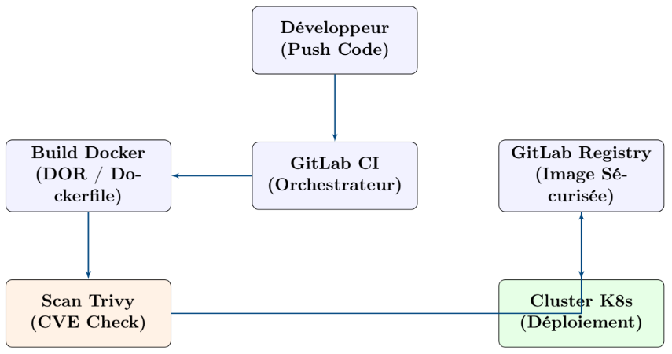

# TP03 — PROJET FINAL DE SESSION

**Objectif :** Déploiement d’une application via GitLab CI/CD sur Kubernetes    
**Niveau :** Master 1 Cybersécurité - CODA Orléans  
**Durée visée :** 1 journée — travail en équipe

## 🎯 OBJECTIF CENTRAL

Concevoir une chaîne de déploiement automatisée respectant les standards de sécurité DevSecOps :
- Scan de vulnérabilités
- Durcissement des conteneurs
- Orchestration
- Résiliente

## 1. ARCHITECTURE DE LA CHAÎNE CI/CD

## 2. DÉTAILS DES BLOCS ET TRAVAIL DEMANDÉ

### 2.1 CONCEPTION DU DOCKERFILE (SÉCURITÉ A LA SOURCE)

C’est l’étape critique. L’image doit être la plus légère et la plus robuste possible.
**Étapes détaillées :**
- **Image de base :** Utiliser une image minimale (ex : alpine ou slim) pour réduire la surface d’attaque
- **Interdiction de l’utilisateur ROOT :** Vous devez créer un utilisateur système sans privilèges et utiliser l’instruction USER en fin de fichier.
- **Optimisation :** Utiliser le Multi-stage build pour ne garder que le binaire/code nécessaire dans l’image finale.
- **Hygiène :** Ne jamais inclure de secrets ou de clés SSH en dur. Utiliser des fichiers .dockerignore.

### 2.2 PIPELINE GITLAB CI/CD (AUTOMATISATION)

Le pipeline doit agir comme un gardien.  
**Étapes détaillées :**
- **Build :** Construire l’image Docker et la nommer avec le tag du commit (CI_COMMIT_SHORT_SHA).
- **Scan de sécurité :** Intégrer un job utilisant Trivy. Le pipeline doit impérativement échouer si une vulnérabilité "CRITICAL" est détectée.
- **Publication :** L’image ne doit être poussée sur le registre que si le scan est validé.

### 2.3 ORCHESTRATION KUBERNETES (PRODUCTION)

Déployer l’application de manière résiliente.
**Étapes détaillées :**
- **Deployment :** Définir les limites de ressources (CPU/RAM).
- **Sondes de santé :** Configurer obligatoirement une livenessProbe et une readinessProbe.
- **Réseau :** Créer un Service et un Ingress pour rendre l’application accessible en HTTP.

## 3. TESTS DE VALIDATION FINAL

Pour valider votre projet, les tests suivants seront réalisés :
1. **Test de résilience :** Suppression d’un Pod (vérifier s’il se recrée).
2. **Test de droits :** Exécuter un whoami dans le conteneur déployé (ne doit pas être root).
3. **Test d’accès :** Vérifier l’URL exposée via l’Ingress.

## 4. GRILLE D'ÉVALUATION

| Composant technique                        | Poids |
| ------------------------------------------ | ----- |
| Fonctionnement du pipeline CI/CD           |  25%  |
| Sécurité et optimisation Dockerfile        |  20%  |
| Configuration et sécurité Kubernetes       |  20%  |
| Qualité de l’architecture et documentation |  15%  |
| Présentation orale et démonstration        |  20%  |